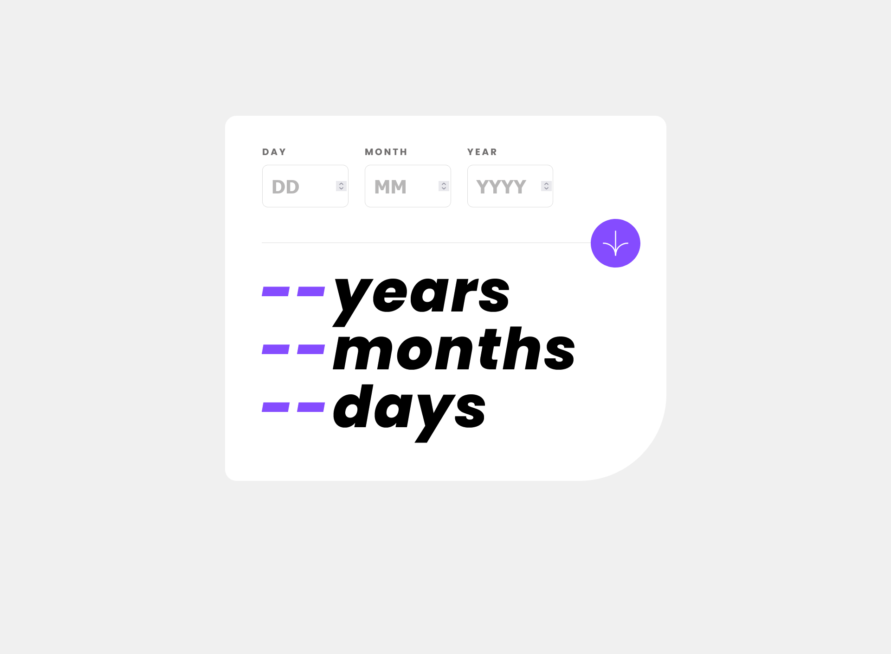
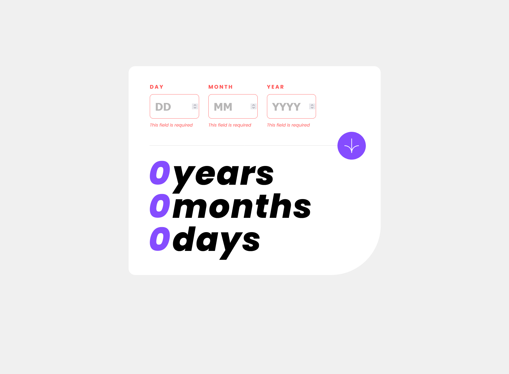
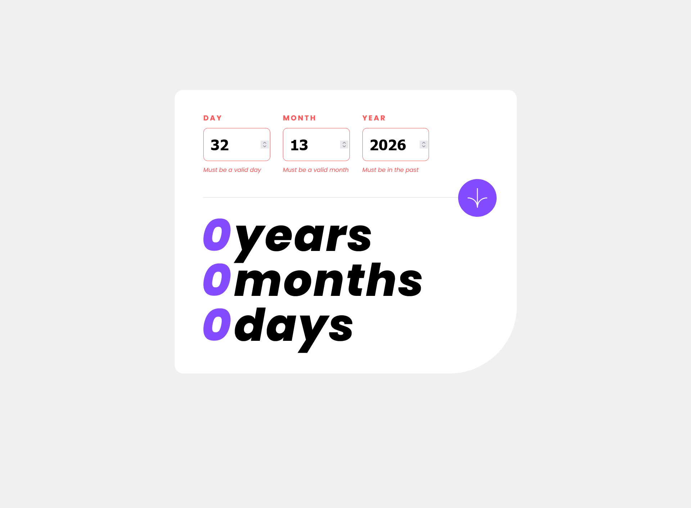
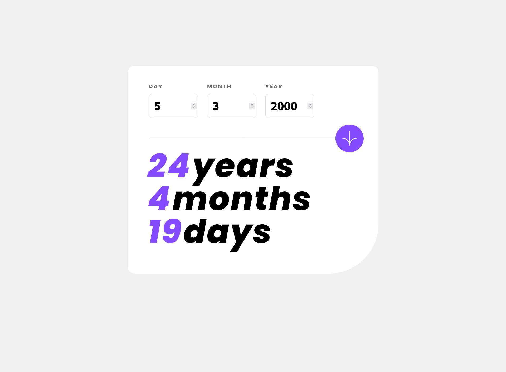

# Frontend Mentor - Age calculator app solution

This is a solution to the [Age calculator app challenge on Frontend Mentor](https://www.frontendmentor.io/challenges/age-calculator-app-dF9DFFpj-Q). Frontend Mentor challenges help you improve your coding skills by building realistic projects. 

## Table of contents

  [Overview](#overview)
  [The challenge](#the-challenge)
  [Screenshot](#screenshot)
  [Links](#links)
  [Built with](#built-with)
  [What I learned](#what-i-learned)
  [Continued development](#continued-development)
  [Author](#author)

## Overview

### The challenge

Users should be able to:

- View an age in years, months, and days after submitting a valid date through the form
- Receive validation errors if:
  - Any field is empty when the form is submitted
  - The day number is not between 1-31
  - The month number is not between 1-12
  - The year is in the future
  - The date is invalid e.g. 31/04/1991 (there are 30 days in April)
- View the optimal layout for the interface depending on their device's screen size
- See hover and focus states for all interactive elements on the page
- **Bonus**: See the age numbers animate to their final number when the form is submitted

### Screenshots

### Links

- Solution URL: [Add solution URL here](https://your-solution-url.com)
- Live Site URL: [Add live site URL here](https://your-live-site-url.com)

### Built with

- [React](https://reactjs.org/) - JS library

### What I learned

By writing this Age Calculator component in React, I learned to manage state with hooks, handle form inputs and validation, implement utility functions, and manipulate dates. I also gained experience with conditional rendering, dynamic styling based on state, and debugging with console logs. This project enhanced my understanding of React functional components, user input handling, error messaging, and providing a responsive and user-friendly interface.

### Continued development

In upcoming projects, I aim to deepen my understanding of React and enhance my skills in CSS, specifically by utilizing Tailwind CSS. 

## Author

- Website - Sude Elbas
